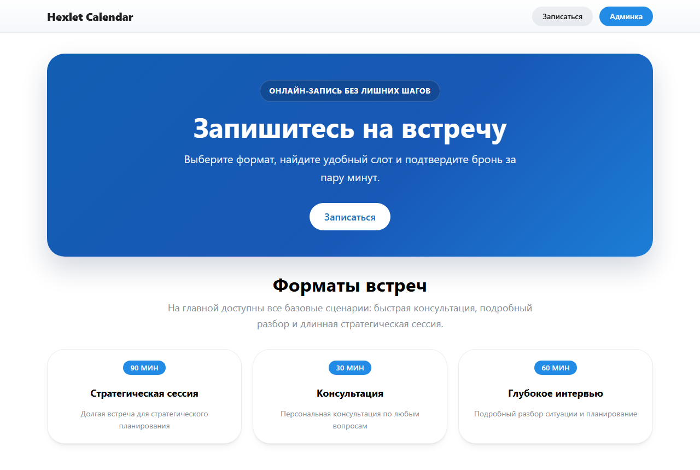
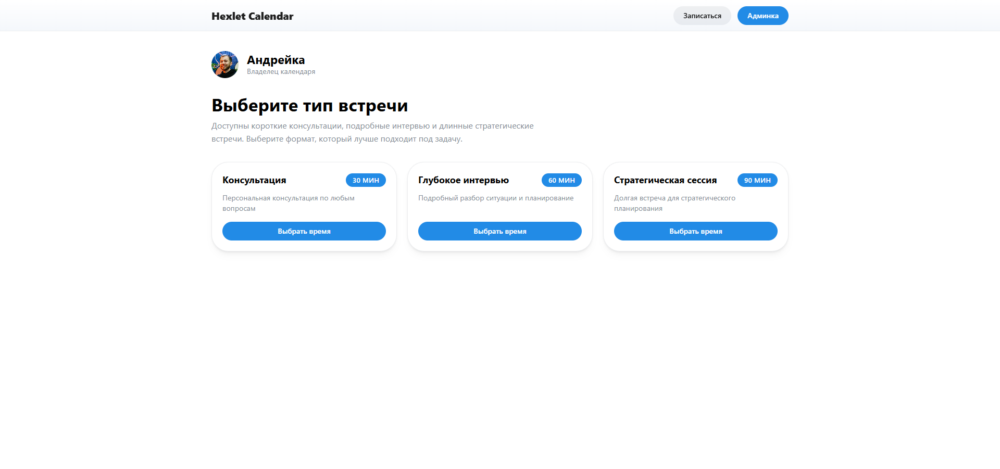
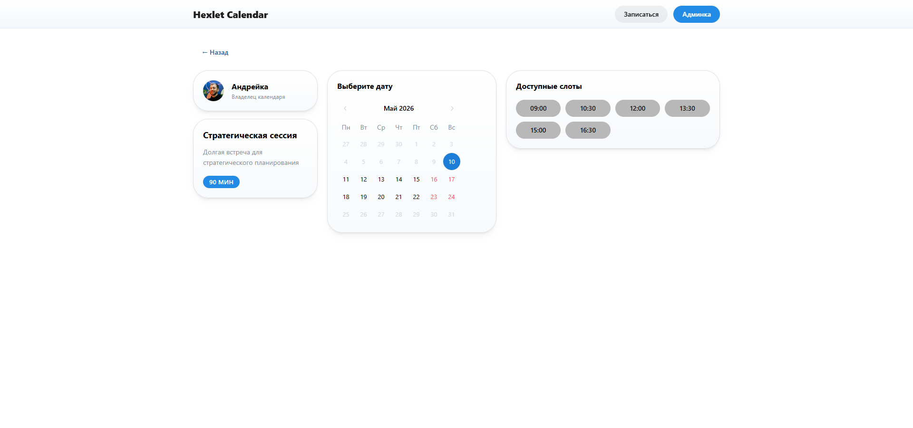

# 📅 Hexlet Calendar

A booking/calendar service where users can browse available meeting types, pick a date within a 14-day window, and book a free slot. Built as a Hexlet educational project.

### Hexlet tests and linter status:
[](https://github.com/andrew-walker91/ai-for-developers-project-386/actions)

## 🌐 Live Demo

Deployed on Railway:

👉 **[https://hexlet-calendar.up.railway.app](https://hexlet-calendar.up.railway.app)**

> Note: Railway's free plan spins down the service after inactivity. The first request after a pause may take up to 30 seconds while the container cold-starts.

> Dark mode: click the 🌙/☀️ icon in the header to toggle. The app also respects your system color scheme preference.

## Screenshots

| Landing Page | Event Types | Slots & Booking |
|---|---|---|
|  |  |  |

## Tech Stack

| Layer | Technology |
|---|---|
| **Frontend** | React 19, Mantine (dark mode support), Vite, TypeScript |
| **Backend** | .NET 8, C# |
| **Database** | SQLite (via EF Core) |
| **API Contract** | TypeSpec → OpenAPI |
| **Container** | Multi-stage Dockerfile |
| **Deployment** | Railway |

## Docker

Build and run the production image:

```bash
docker build -t hexlet-calendar .
docker run -p 8080:8080 hexlet-calendar
```

Open [http://localhost:8080](http://localhost:8080). The application serves both the frontend SPA and the API on the same port.

## Local Development

```bash
make install          # Install npm dependencies
make dev-backend      # Terminal 1: .NET backend on :5000
make dev-frontend     # Terminal 2: Vite dev server on :5173
make test             # Lint + typecheck
make test-e2e         # Playwright e2e tests (backend must be running)
```

See [`AGENTS.md`](AGENTS.md) for detailed architecture, project layout, and workflow commands.

## Project Structure

```
apps/
├── frontend/     # React SPA (Mantine + Vite)
├── backend/       # .NET 8 Web API
packages/
└── typespec/     # API contract (TypeSpec)
```

## CI/CD

| Workflow | Trigger | What it does |
|---|---|---|
| `ci.yml` | Push/PR to `main` | Lint + typecheck |
| `playwright.yml` | Push/PR to `main` | E2E tests via Playwright |
| `deploy.yml` | Push to `main` | Build Docker image → push to GHCR → deploy to Railway |
